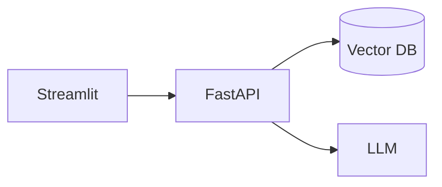

# Day 42 · Task 3: README

> Add an architecture diagram (draw.io or Mermaid).

# Chat with your docs

## Architecture

```mermaid
flowchart LR
  UI[Streamlit] --> API[FastAPI]
  API --> VDB[(Vector DB)]
  API --> LLM[LLM]
```

## How to run

## Example questions and answers

## What I'd improve
