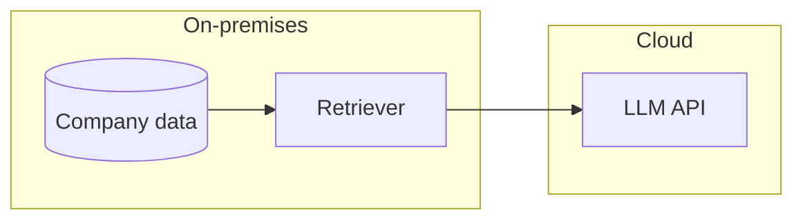

# Day 75 · Task 3 · Practice: Hybrid architecture

> Draw: data stays on-prem, model in cloud (or the reverse).

## Hybrid architecture

```mermaid
flowchart LR
  subgraph OnPrem[On-premises]
    DB[(Company data)] --> RAG[Retriever]
  end
  subgraph Cloud
    LLM[LLM API]
  end
  RAG --> LLM
```
- What data leaves the building? How do you limit it?
